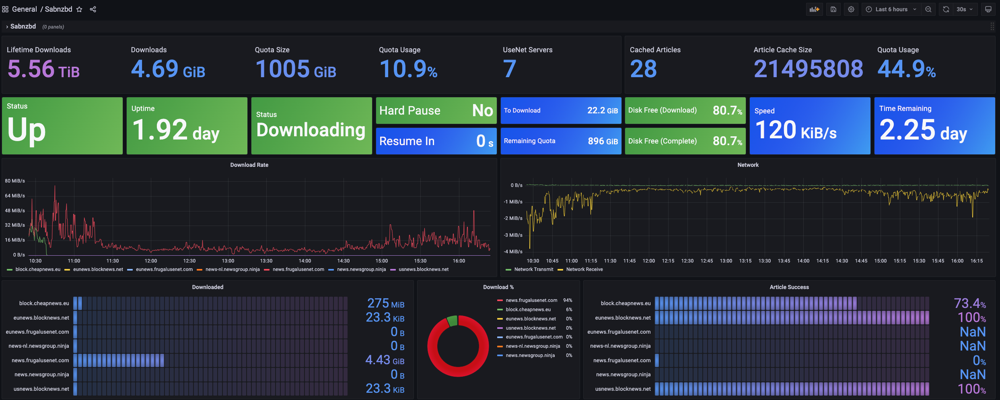

# Prometheus Sabnzbd Exporter

    

Prometheus SabnzbD Exporter will, when polled by prometheus, collect statistics from SabnzbD API Endpoints.




Work in Progress! Will introduce README when ready for use. While the exporter functions, assume the flags, config, and metrics will be volatile and undocumented until you see a v0.0.1 release & official README.

## Operating the Exporter

Prometheus-SabnzbD-Exporter can be configured via flag, EnvVar, or Config File.
```bash
      --api_key string       api key of sabnzbd
      --base_url string      base url of sabnzbd
      --config strings       path to one or more .yaml config files
      --go_collector         enables go stats exporter
      --listen_port string   port to listen on (default "8080")
      --log_level string     log level (debug, info, warn, error) (default "info")
      --process_collector    enables process stats exporter
```

So normal usage would be:

```bash
prometheus-sabnzbd-exporter \
    --api_key <your key> \
    --base_url http://localhost:8080 \
    --listen_port 8081
```

## Running via Docker

```bash
docker run -d --name sabnzbd-exporter \
    -e SABNZBD_API_KEY=<yourkey>
    -e SABNZBD_BASE_URL=http://localhost:8080
    -e SABNZBD_LISTEN_PORT=8080
    ghcr.io/rtrox/prometheus-sabnzbd-exporter:latest
```

## Running via Kubernetes

Example Manifests are available in the [kubernetes/manifests](kubernetes/manifests) directory. Simply edit as needed and:

```bash
kubectl apply -f ./kubernetes/manifests/
```

## Example Metrics Output
```
# HELP exporter_info Info about this sabnzbd-exporter
# TYPE exporter_info gauge
exporter_info{app_name="sabnzbd-exporter",base_url="https://sab.example.com/",version="x.x.x"} 1
# HELP sabnzbd_article_cache_articles Total Articles Cached in the SabnzbD instance
# TYPE sabnzbd_article_cache_articles gauge
sabnzbd_article_cache_articles{target="https://sab.example.com/"} 17
# HELP sabnzbd_article_cache_bytes Total Bytes Cached in the SabnzbD instance Article Cache
# TYPE sabnzbd_article_cache_bytes gauge
sabnzbd_article_cache_bytes{target="https://sab.example.com/"} 1.31072e+07
# HELP sabnzbd_disk_total_bytes Total Bytes on the SabnzbD instance's disk
# TYPE sabnzbd_disk_total_bytes gauge
sabnzbd_disk_total_bytes{folder="complete",target="https://sab.example.com/"} 4.4971327488e+10
sabnzbd_disk_total_bytes{folder="download",target="https://sab.example.com/"} 4.4971327488e+10
# HELP sabnzbd_disk_used_bytes Used Bytes Used on the SabnzbD instance's disk
# TYPE sabnzbd_disk_used_bytes gauge
sabnzbd_disk_used_bytes{folder="complete",target="https://sab.example.com/"} 3.627238293504e+10
sabnzbd_disk_used_bytes{folder="download",target="https://sab.example.com/"} 3.627238293504e+10
# HELP sabnzbd_downloaded_bytes Total Bytes Downloaded by SABnzbd
# TYPE sabnzbd_downloaded_bytes counter
sabnzbd_downloaded_bytes{target="https://sab.example.com/"} 6.110903980145e+12
# HELP sabnzbd_info Info about the target SabnzbD instance
# TYPE sabnzbd_info gauge
sabnzbd_info{status="Downloading",target="https://sab.example.com/",version="3.7.2"} 1
# HELP sabnzbd_pause_duration_seconds Duration until the SabnzbD instance is unpaused
# TYPE sabnzbd_pause_duration_seconds gauge
sabnzbd_pause_duration_seconds{target="https://sab.example.com/"} 0
# HELP sabnzbd_paused Is the target SabnzbD instance paused
# TYPE sabnzbd_paused gauge
sabnzbd_paused{target="https://sab.example.com/"} 0
# HELP sabnzbd_paused_all Are all the target SabnzbD instance's queues paused
# TYPE sabnzbd_paused_all gauge
sabnzbd_paused_all{target="https://sab.example.com/"} 0
# HELP sabnzbd_queue_length Total Number of Items in the SabnzbD instance's queue
# TYPE sabnzbd_queue_length gauge
sabnzbd_queue_length{target="https://sab.example.com/"} 3
# HELP sabnzbd_queue_query_duration_seconds Duration querying the queue endpoint of SabnzbD
# TYPE sabnzbd_queue_query_duration_seconds gauge
sabnzbd_queue_query_duration_seconds{target="https://sab.example.com/"} 0.195671094
# HELP sabnzbd_quota_bytes Total Bytes in the SabnzbD instance's quota
# TYPE sabnzbd_quota_bytes gauge
sabnzbd_quota_bytes{target="https://sab.example.com/"} 1.07911053312e+12
# HELP sabnzbd_remaining_bytes Total Bytes Remaining to Download by the SabnzbD instance
# TYPE sabnzbd_remaining_bytes gauge
sabnzbd_remaining_bytes{target="https://sab.example.com/"} 2.368830701568e+10
# HELP sabnzbd_remaining_quota_bytes Total Bytes Left in the SabnzbD instance's quota
# TYPE sabnzbd_remaining_quota_bytes gauge
sabnzbd_remaining_quota_bytes{target="https://sab.example.com/"} 9.61535803392e+11
# HELP sabnzbd_scrape_duration_seconds Duration of the SabnzbD scrape
# TYPE sabnzbd_scrape_duration_seconds gauge
sabnzbd_scrape_duration_seconds{target="https://sab.example.com/"} 0.197034532
# HELP sabnzbd_server_articles_success Total Articles Successfully downloaded from UseNet Server
# TYPE sabnzbd_server_articles_success counter
sabnzbd_server_articles_success{server="block.cheapnews.eu",target="https://sab.example.com/"} 1116
sabnzbd_server_articles_success{server="eunews.blocknews.net",target="https://sab.example.com/"} 1116
sabnzbd_server_articles_success{server="eunews.frugalusenet.com",target="https://sab.example.com/"} 26521
sabnzbd_server_articles_success{server="news-nl.newsgroup.ninja",target="https://sab.example.com/"} 26521
sabnzbd_server_articles_success{server="news.frugalusenet.com",target="https://sab.example.com/"} 26521
sabnzbd_server_articles_success{server="news.newsgroup.ninja",target="https://sab.example.com/"} 26521
sabnzbd_server_articles_success{server="usnews.blocknews.net",target="https://sab.example.com/"} 1116
# HELP sabnzbd_server_articles_total Total Articles Attempted to download from UseNet Server
# TYPE sabnzbd_server_articles_total counter
sabnzbd_server_articles_total{server="block.cheapnews.eu",target="https://sab.example.com/"} 26521
sabnzbd_server_articles_total{server="eunews.blocknews.net",target="https://sab.example.com/"} 1116
sabnzbd_server_articles_total{server="eunews.frugalusenet.com",target="https://sab.example.com/"} 26521
sabnzbd_server_articles_total{server="news-nl.newsgroup.ninja",target="https://sab.example.com/"} 26521
sabnzbd_server_articles_total{server="news.frugalusenet.com",target="https://sab.example.com/"} 145788
sabnzbd_server_articles_total{server="news.newsgroup.ninja",target="https://sab.example.com/"} 33012
sabnzbd_server_articles_total{server="usnews.blocknews.net",target="https://sab.example.com/"} 1116
# HELP sabnzbd_server_downloaded_bytes Total Bytes Downloaded from UseNet Server
# TYPE sabnzbd_server_downloaded_bytes counter
sabnzbd_server_downloaded_bytes{server="block.cheapnews.eu",target="https://sab.example.com/"} 2.5008723108e+10
sabnzbd_server_downloaded_bytes{server="eunews.blocknews.net",target="https://sab.example.com/"} 1.10972641e+08
sabnzbd_server_downloaded_bytes{server="eunews.frugalusenet.com",target="https://sab.example.com/"} 8.6550997e+07
sabnzbd_server_downloaded_bytes{server="news-nl.newsgroup.ninja",target="https://sab.example.com/"} 7.0701057e+07
sabnzbd_server_downloaded_bytes{server="news.frugalusenet.com",target="https://sab.example.com/"} 5.165202725841e+12
sabnzbd_server_downloaded_bytes{server="news.newsgroup.ninja",target="https://sab.example.com/"} 9.20376147146e+11
sabnzbd_server_downloaded_bytes{server="usnews.blocknews.net",target="https://sab.example.com/"} 4.8159355e+07
# HELP sabnzbd_server_stats_query_duration_seconds Duration querying the server_stats endpoint of SabnzbD
# TYPE sabnzbd_server_stats_query_duration_seconds gauge
sabnzbd_server_stats_query_duration_seconds{target="https://sab.example.com/"} 0.196962172
# HELP sabnzbd_speed_bps Total Bytes Downloaded per Second by the SabnzbD instance
# TYPE sabnzbd_speed_bps gauge
sabnzbd_speed_bps{target="https://sab.example.com/"} 224092.16
# HELP sabnzbd_status Status of the SabnzbD instance's queue (0=Unknown, 1=Idle, 2=Paused, 3=Downloading)
# TYPE sabnzbd_status gauge
sabnzbd_status{target="https://sab.example.com/"} 3
# HELP sabnzbd_time_estimate_seconds Estimated Time Remaining to Download by the SabnzbD instance
# TYPE sabnzbd_time_estimate_seconds gauge
sabnzbd_time_estimate_seconds{target="https://sab.example.com/"} 105707
# HELP sabnzbd_total_bytes Total Bytes in queue to Download by the SabnzbD instance
# TYPE sabnzbd_total_bytes gauge
sabnzbd_total_bytes{target="https://sab.example.com/"} 2.456350097408e+10
# HELP sabnzbd_warnings Total Warnings in the SabnzbD instance's queue
# TYPE sabnzbd_warnings gauge
sabnzbd_warnings{target="https://sab.example.com/"} 0
```
